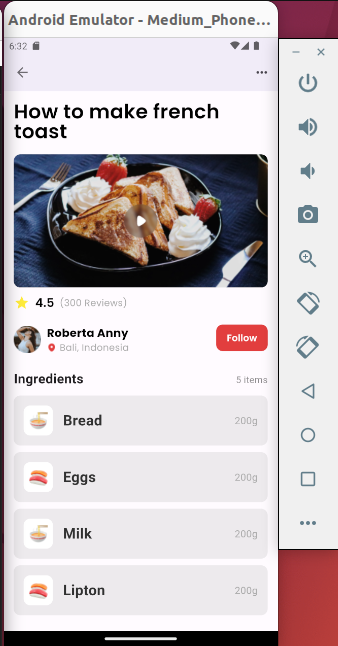

# Flutter Recipe App

This Flutter project is a beautifully designed recipe application that showcases how to make French toast. It demonstrates the use of various Flutter widgets and techniques to create a user-friendly and aesthetically pleasing mobile application. The app utilizes Google Fonts for typography, enhancing the visual appeal and readability of the text. The project structure is well-organized, making it easy for developers to understand and modify according to their needs.

## Features

- **Custom Theme**: The app uses a custom theme with a color scheme based on deep purple, leveraging Material 3 design principles.
- **Interactive UI**: The home page presents an engaging layout that includes a recipe header, image section with a play button overlay, review section, follow section, and a dynamic list of ingredients.
- **Ingredient Model**: A simple model class (`Ingredient`) is used to represent the ingredients with their image, name, and weight.
- **Reusable Widgets**: The app features several custom widgets such as `RecipeHeader`, `RecipeImageSection`, `ReviewSection`, `FollowSection`, and `IngredientsSection` to display different parts of the UI.
- **Asset Management**: Static assets like images are efficiently managed and used throughout the app to create a more engaging user experience.
- **Responsive Design**: The layout is designed to be responsive, ensuring a great user experience across different device sizes.



## Widgets Used

- `MaterialApp`, `Scaffold`, `AppBar`, `IconButton`, `Padding`, `Column`, `Text`, `Stack`, `ClipRRect`, `Image.asset`, `Row`, `Icon`, `TextButton`, `Expanded`, `ListView.builder`, `Container`, and more.
- Google Fonts for custom typography.

## Getting Started

To run this project, ensure you have Flutter installed on your machine. Clone the repository, navigate to the project directory, and run:

```bash
flutter pub get
flutter run
```
